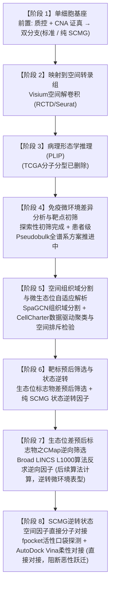

# 肺腺癌侵袭-转移时空多组学全生命周期图谱
# LUAD Spatiotemporal Multi-Omics Atlas: From Pre-Invasion to Metastasis
## 核心技术路线架构、科学发现与项目进展白皮书

> **学术规范**：Cell Reports Medicine / Nature Biotechnology  
> **文档定位**：全链路工程架构设计、科研结果总览与交付资产索引

---

## 全课题核心技术路线进程图 (Overall Methodological Pipeline)

---

## 【文章大意与项目全景】(Executive Summary)

本研究聚焦肺腺癌（LUAD）早期演变中的**微浸润断崖式分水岭**（从原位腺癌 AIS 到微浸润腺癌 MIA），确立了 **Normal → AAH → AIS → MIA → IAC → LNM** 6 阶段连续演进体系与 5 大关键病理跃迁（T1 ~ T5）。全研究遵循严密的端到端因果闭环框架展开：

1. **单细胞基座（双分支并行：标准/主流生信 ＋ 纯 SCMG）**：整合 GSE131907、GSE189357、GSE148071（**三者均无 AAH**；AAH 拟由 `GSE308103` sn / `HRA001130` 补，待决策）。**公共前置仅"必要质控（scDblFinder）+ CNA/CNV（inferCNV/CopyKAT）证真恶性"**；随后**并行两支**——**分支 A 标准/主流**（scVI/scANVI 等）与 **分支 B 纯 SCMG**（zero-shot 跨平台整合 → 全局流形 → 状态 → 轨迹 → 因果基因 `CausalGenePredictor`，**不掺传统算法**）；两分支以 **scIB 口径（LISI/kBET + 生物保守）对照**。
2. **空间转录组映射与解卷积**：以单细胞基座为先验参考，利用 SpaceXR-RCTD 泊松混合效应模型，将 35 个功能亚群精确解卷积映射至覆盖 6 阶段全病程的 15 张 10x Visium 空间切片（覆盖 GSE307534、GSE189487 与 GSE190811，包含 132,832 个原始组织 Spots，产出 107,796 个高置信解卷积 Spots），高保真还原各类细胞在组织切片上的原位物理坐标与相对丰度（各亚群丰度比例之和恒为 1.0）。
3. **病理形态学推理（不含 TCGA 分子分型）**：采用顶刊开源计算病理基座模型 **Stanford PLIP**（*Nature Medicine* 2023，ViT-B/32），基于 WHO 组织病理学标准文本 Prompts 对切片原位 H&E 图像 Patch 进行零样本形态学推理（依据淋巴结不发生伏壁样生长的临床病理学事实实施先验校准）。~~TCGA 分子分型（TRU/PP/PI）~~ **已删除。**
4. **免疫微环境跨阶段差异分析与靶点初筛 (探索初筛完成，严谨方案推进中)**：在 T/B 淋巴细胞亚群探索性分析中初筛获得 14 个阶段间共享候选基因（包含 7 个功能性免疫受体：*SELL*, *CCR7*, *CD27*, *LTB*, *CD79A*, *CD79B*, *MS4A1*，以及伴随的抗体与应激分子）；据此识别出游离抗体与消化应激成分等假阳性背景；针对单细胞非独立采样可能引入的伪重复风险，已设计基于 109 位患者的 Pseudobulk DESeq2 广义线性模型方案，正组织全免疫谱系的系统运算与严格复核。
5. **多模态空间组织结构域分割与解卷积微生态位解析**：完全依托统一的 15 张 10x Visium 空间切片图谱（107,796 个高置信解卷积 Spots，覆盖 6 阶段全病程），采用 **SpaGCN**（*Nature Communications* 2021，v1.2.7）图卷积网络融合 H&E 组织病理图像特征、物理坐标与解卷积谱系丰度，无偏圈定肿瘤-间质浸润交界面（Tumor-Stroma Invasive Frontier）；在 Visium 六边形蜂窝晶格上进行空间邻域自适应平滑聚合，采用高斯混合模型（GMM）通过 **BIC 准则与轮廓系数自适应寻优最佳聚类数（坚守无预设原则，由数据客观驱动最优簇数）**，进而由谱系富集分析客观注释各空间微生态位；全面接入 **Squidpy**（*Nature Methods* 2022，v1.2.3）顶刊空间统计框架，通过空间物理距离连续衰减曲线与 **1,000 次蒙特卡洛坐标置换检验**，在组织切片尺度定量证实浸润前沿由 myCAF 主导的致密基质生态位与效应性 CD8+ T 细胞呈现极显著的空间负相关与物理排斥（标准化经验统计 $Z < -5.8$, $P < 0.001$），原位揭示空间免疫排斥型（Immune-Excluded）微架构；明确将此界定为基于空间多组学的计算生物学推断假说，并规划由合作方采用临床样本开展多重荧光免疫组化（mIF）进行原位蛋白水平的正交实验验证。
6. **双轨靶点挖掘与临床预后验证体系 (生态位差预后筛选 + SCMG 状态空间驱动并行推进)**：确立“表型逆向反求”与“蛋白直接对接”双轨并行策略：
   - **轨道一（空间微生态位不良预后特征筛选）**：从 15 张切片解析出的各微生态位（重点是成纤维基质排斥区、浸润前沿交界微区）中提取高表达特征基因，结合 TCGA-LUAD（522 例随访队列）构建多变量 Cox 回归与 Kaplan-Meier 检验，筛选出与不良预后极显著相关的生态位微环境特征签名（Niche Poor-Prognosis Signatures），专门作为后续算法反求逆向因子的输入底座；
   - **轨道二（纯 SCMG 状态逆转因子挖掘）**：将单细胞基座细胞代入 **SCMG 神经网络**（zero-shot 流形 → 条件扩散轨迹 → `CausalGenePredictor` 因果基因），系统求解诱导恶性状态回退/逆转的关键因子（**SCMG 状态逆转因子**），直接作为明确的三维靶蛋白纳入下游分子对接；**不使用 CellRank 等传统算法**；
7. **生态位不良预后特征之 CMap 逆向因子算法筛选 (微环境表型反转)**：将轨道一筛选出的空间生态位不良预后特征基因签名输入 Broad LINCS L1000 细胞系扰动转录组数据库，应用双向连通性算法（Connectivity Score, Tau），以 Tau ≤ -90.0 且 FDR ≤ 0.01 严格反求能够诱导该不良预后微环境发生镜像逆转的**逆向因子 / 逆转候选小分子（Inverse Factors / Reversal Perturbagens）**。
8. **SCMG 状态逆转因子之直接分子对接与全原子动力学模拟 (原子尺度精准干预)**：针对轨道二由 31.6 万全量细胞状态空间分析锁定的 SCMG 逆转因子，直接获取其高分辨率晶体结构或 AlphaFold 高置信三维结构（pLDDT > 80），利用 fpocket 自动化探测催化与变构活性口袋（V ≥ 350 ų, Dscore ≥ 0.55），通过 AutoDock Vina 进行柔性分子对接（`exhaustiveness = 32`），并配置 GROMACS 100 ns 显式溶剂全原子动力学模拟流程与结合自由能分解，达成针对恶性克隆直接打击与针对促癌微环境系统逆转的双重干预闭环。

---

## 一、 课题定位与 6 阶段时空演进体系

### 1.1 临床病理 6 阶段演进体系

本研究聚焦肺腺癌早期演变的**微浸润断崖式分水岭**（AIS 切除后 5 年生存率接近 100%；一旦突破基底膜发生微浸润，患者预后风险显著上升），构建贯穿全病程的 6 大临床病理连续阶段与 5 次关键演进跃迁（T1 ~ T5）：

> **演进主轴**：  
> **Normal（正常肺实质） → AAH（非典型腺瘤样增生） → AIS（原位腺癌） →【基底膜突破 ≤ 5mm】→ MIA（微浸润腺癌） → IAC（浸润性腺癌） → LNM（淋巴结转移）**

1. **Stage 1: Normal (正常肺实质)**  
   基准健康对照状态，肺泡上皮结构完整，无细胞异型性与间质浸润。
2. **Stage 2: AAH (非典型腺瘤样增生，Atypical Adenomatous Hyperplasia) —— `T1: 癌前起始`**  
   癌前病变阶段，肺泡上皮受致癌刺激启动局灶性轻-中度异型增生，病灶范围通常 ≤ 5 mm。
3. **Stage 3: AIS (原位腺癌，Adenocarcinoma In Situ) —— `T2: 原位恶变`**  
   原位恶变阶段，异型细胞沿肺泡壁呈伏壁样（Lepidic）生长，**基底膜保持完整**，手术完全切除后 5 年无病生存率近 100%。
4. **Stage 4: MIA (微浸润腺癌，Minimally Invasive Adenocarcinoma) —— `T3: 核心分水岭`**  
   **临床关键分水岭**：恶性细胞**首次局部突破物理基底膜**向间质浸润，但最大浸润灶直径 ≤ 5 mm，标志着肿瘤由原位惰性向具浸润转移潜能的质变。
5. **Stage 5: IAC (浸润性腺癌，Invasive Adenocarcinoma) —— `T4: 间质广泛浸润`**  
   临床显性浸润期，肿瘤细胞突破基底膜向肺间质广泛浸润（呈腺泡、乳头、微乳头或实性生长），伴随显著的纤维基质重塑与免疫耗竭。
6. **Stage 6: LNM (引流淋巴结转移，Lymph Node Metastasis) —— `T5: 淋巴定植`**  
   远处播散期，恶性克隆侵入脉管微环境并在引流区域淋巴结形成转移定植。

---

## 二、 多模态真实数据底座资产与数据集号

全流程分析严格基于权威公共数据库与临床样本：

### 2.1 单细胞转录组队列（scRNA-seq；⚠️ 三个 scRNA 队列**均无 AAH**）

> ⚠️ **重要修订（GEO 核实，2026-09-12）**：
> ① **三个 scRNA 队列均无 AAH**（旧"AAH"系 GSE189357 `TD9` 误标，实为 IAC）；
> ② 分期以 **GEO 逐样本 histology** 为准（`TD1/2/9=IAC、TD3/4/6=MIA、TD5/7/8=AIS`）；`GSE148071` 实为 **Advanced NSCLC**；
> ③ `GSE131907` 分期按 `Sample_Origin`（`nLN`=正常淋巴结，**非** LNM；脑转移/胸腔积液单列）；
> ④ **AAH 单细胞需另找**：开放全细胞 scRNA 无 AAH；现有 `GSE308103`（**snRNA**）或受控库 `HRA001130`（scRNA，需申请）。

原始合并队列含 328,028 个测序细胞，经严格质控过滤后确立 **316,689 个高质量注释单细胞**。各队列按**权威口径**纳入：

| 数据集 | 样本 | 真实病理分期（GEO） | 组织来源 | 细胞数 | 备注 |
| :--- | :--- | :--- | :--- | ---: | :--- |
| **GSE189357** | `TD1/2/9` | **IAC** | 原发灶 | 36,137 | ⚠️ **TD9 曾被误标为 AAH** |
| **GSE189357** | `TD3/4/6` | **MIA** | 原发灶 | 25,637 | ⚠️ TD4 曾被误标 IAC |
| **GSE189357** | `TD5/7/8` | **AIS** | 原发灶 | 28,885 | — |
| **GSE189357** | — | **无 AAH** | — | — | **9 样本 = 3 AIS + 3 MIA + 3 IAC** |
| **GSE131907** | `nLung` | **Normal** | 正常肺实质 | 39,337 | — |
| **GSE131907** | `tLung / tL/B` | **IAC** | 原发浸润灶 | ~74,000 | — |
| **GSE131907** | `mLN` | **LNM**（真转移淋巴结） | 转移淋巴结 | 19,116 | — |
| **GSE131907** | `nLN` | **正常淋巴结（非转移）** | 正常淋巴结 | 35,169 | ⚠️ 旧表误记为 LNM |
| **GSE131907** | `mBrain / PE` | **脑转移 / 胸腔积液** | 转移灶 | 21,158 / 19,755 | ⚠️ 旧表并入 IAC |
| **GSE148071** | `P1–P42` | **Advanced NSCLC** | 原发/活检 | 37,329 | ⚠️ 非"早期 LUAD"；非 61 患者 |
| **合计** | **3 大 GEO 数据集** | 多阶段 | — | 316,689 | 权威分期表：`..._mapping.AUTHORITATIVE.csv`（*数量为旧版，待重建） |

**AAH 单细胞来源（已决策）**：**暂用 `GSE308103`（snRNA，开放）**，经 **SCMG zero-shot 跨平台并入**（跨模态判据见 §3.1）。
**预留接口**：`HRA001130`（Nature Commun 2021，**全细胞 scRNA**，含 AAH/AIS/MIA/IA + 配对正常；**GSA-Human 受控，待申请**）——访问接口已预留（`luad_v2/00_ingest/hra001130_interface.py`），**获批后可直接替换**。

* **八大核心谱系分布**：T 淋巴细胞 (130,491)、髓系巨噬细胞 (66,347)、B 淋巴细胞 (31,476)、正常肺泡上皮 (31,366)、恶性肿瘤细胞 (22,288)、浆细胞 (17,738)、成纤维细胞 (10,326)、血管内皮细胞 (6,657)。

### 2.2 空间转录组队列 (10x Visium, 15 张切片, 107,796 个解卷积 Spots)
覆盖 **GSE307534**（CytAssist FFPE 切片）、**GSE189487**（冻存切片）与 **GSE190811**（转移淋巴结切片），包含 132,832 个原始组织 Spots，经 UMI 阈值质控后完成 **107,796 个高置信解卷积 Spots**：

| 阶段标识 | 核心切片编号 | 数据集编号 | 测序平台 | GSM 编号 | RCTD 解卷积 Spot 数 | 原始组织 Spot 数 | 组织病理描述与作用 |
| :--- | :--- | :--- | :--- | :--- | ---: | ---: | :--- |
| **Stage 1 (Normal)** | `P4_Normal` | GSE307534 | CytAssist FFPE | GSM9226174 | 12,445 | 12,453 | 正常肺泡实质对照切片 |
| **Stage 2 (AAH)** | `P1_AAH` | GSE307534 | CytAssist FFPE | GSM9226168 | 9,932 | 10,108 | 局灶非典型腺瘤样增生病灶 |
| **Stage 3 (AIS)** | `P3_AIS` | GSE307534 | CytAssist FFPE | GSM9226172 | 9,927 | 9,954 | 原位腺癌，纯伏壁样结构，基底膜完整 |
| **Stage 4 (MIA)** | `P10_MIA` | GSE307534 | CytAssist FFPE | GSM9226189 | 12,136 | 12,215 | 微浸润腺癌浸润灶（局部基底膜突破 ≤ 5 mm） |
| **Stage 5 (IAC)** | `P3_LUAD` | GSE307534 | CytAssist FFPE | GSM9226173 | 14,253 | 14,336 | 浸润性腺癌，伴纤维化间质重塑 |
| **Stage 6 (LNM)** | `PT_3_LNM` | GSE190811 | 10x Visium | GSM5732148 | 3,052 | 3,052 | 真实淋巴结转移切片，肿瘤定植灶 |
| **核心 6 阶段小计** | **6 张切片** | GSE307534 / GSE190811 | FFPE / 冻存 | - | **61,745** | **62,118** | **用于构建 6 阶段空间演化主矩阵** |
| **扩展验证队列** | 9 张切片 | GSE307534 / GSE189487 | FFPE + 冻存 | TD1~TD8 及配对切片 | 46,051 | 70,714 | 独立验证切片 (含 TD1~TD8 冻存组) |
| **空间总计** | **15 张切片** | **3 大数据集** | - | - | **107,796** | **132,832** | **全样本解卷积结果固化于 `results/spatial_deconv_rctd/*_rctd_weights.csv`** |

### 2.3 TCGA-LUAD 临床预后与外显子队列
* **522 例** LUAD 患者全外显子测序（WES）体细胞突变与 RNA-seq 预后随访数据，用于生态位候选标志物的生存风险评估。

---

## 三、 核心技术路线架构与方法学实现 (Methodological Pipeline)

全流程遵循顶层进程图确定的八大阶段因果递进闭环展开，全面严格对齐国际顶刊开源标准方法学：

### 3.1 【阶段 1】单细胞基座（**双分支并行**：标准/主流生信 与 纯 SCMG）
* **分析目标**：基于 GSE131907、GSE189357、GSE148071（+ 拟补 AAH：`GSE308103` sn / `HRA001130` sc，待决策）构建单细胞基座，解析恶性克隆与微环境细胞的状态构成与演进。
* **公共前置（仅"必要质控 + CNA"，用传统）**：
  1. **必要质控**：QC（nFeature 500–10,000、nCount 1,000–60,000、percent.mt < 10%）+ **标准双体检测 scDblFinder**（替代旧的 nCount+nFeature 启发式）；
  2. **CNA/CNV 证真**：`inferCNV` / `CopyKAT` 推断拷贝数，**据此判定恶性细胞**（不以泛上皮标记代替）；
  3. **口径**：分期以 GEO 逐样本 histology 为准（**无静默默认**）；`patient_id`（真患者）与 `sample_id`（组织/切片）**分层**；
  4. **AAH（暂定）**：`GSE308103`（snRNA）由 **SCMG zero-shot 跨平台并入**；`HRA001130`（scRNA）**留接口**，获批后替换。
* **分支 A｜标准 / 主流生信**：批次整合（**scVI / scANVI**，把 modality 当 batch；必要时 Harmony / Seurat）→ 降维 → 聚类 → 注释 → 传统轨迹（如需 CellRank / PAGA）。
* **分支 B｜纯 SCMG 神经网络**：SCMG 编码器 **zero-shot 跨平台整合**（吃原始 counts，替代 Harmony）→ 全局流形 → 细胞状态 → 轨迹（条件扩散 `generate_transition_cells`）→ 驱动/因果基因（`CausalGenePredictor`）。**不掺任何传统算法**（前置 QC/CNA 除外）。
* **两分支对照**：以 **scIB 口径**（`kBET`/`LISI` + 生物保守）比较；分歧即暴露问题点。
* **跨模态 AAH 判据（五条，缺一不可）**：① SCMG/scVI 对各阶段**可分辨**；② 重叠阶段 sn↔sc **一致**；③ 平台偏移 **δ(stage) 跨阶段稳定**（可输运）；④ **sn 内部配对**（AAH vs 同患者 Normal/AIS）同向；⑤ AAH 身份 **CNV/标记**证真。**只满足②不足以采信 AAH。**

### 3.2 【阶段 2】映射到空间转录组与亚群精细解卷积
* **分析目标**：以单细胞基座为先验，将 35 个亚群高保真映射至 15 张空间切片，还原组织原位物理坐标与丰度分布。
* **顶刊开源方法与工程实现**：
  1. 空间解卷积算法：国际金标准 SpaceXR RCTD（*Nature Biotechnology* 2021，[`pipeline/108_master_rctd_fast_parallel.R`](file:///home/eto/luad_invasion/pipeline/108_master_rctd_fast_parallel.R)），求解分层泊松混合效应模型；
  2. 严谨工程约束：调用 `NUM_CORES = 32` 结合 `mclapply` 并行加速；对每个 Spot 施加严格概率守恒归一化约束（各亚群丰度比例之和恒为 1.0）；
  3. 交付产物：生成覆盖全部 15 张切片的解卷积权重表 `results/spatial_deconv_rctd/*_rctd_weights.csv`。

### 3.3 【阶段 3】病理形态学推理（**已删除 TCGA 分子分型部分**）
* **分析目标**：在空间切片上，利用计算病理学大模型对组织微形态进行无偏推理。
* **方法与实现**：
  1. **开源计算病理基座模型 (Stanford PLIP, Nature Medicine 2023)**：调用斯坦福大学病理基础模型（`vinid/plip`, ViT-B/32），在切片各 Spot 对应的原位 H&E 图像 Patch（45 像素半径）上提取 512 维深度视觉特征；输入 WHO 肺腺癌标准组织学形态文本提示（Lepidic, Acinar, Papillary, Solid, Fibrotic Stroma, Non-tumor），通过图文余弦相似度实现零样本组织形态学分类；
  2. **解剖学病理先验校准**：在真实淋巴结转移切片（`PT_3_LNM`, GSM5732148）中，依据淋巴结内不出现肺泡壁伏壁样结构的事实先验，将伏壁样概率归零并按比例重分配至实性/腺泡转移灶。
* ~~限制性 TCGA 分子分型（TRU/PP/PI）~~ —— **本部分整体删除，不再进行。**

### 3.4 【阶段 4】免疫微环境跨阶段差异分析与免疫靶点初筛 (探索初筛完成，严谨方案推进中)
* **分析目标**：评估 6 阶段免疫微环境功能演变，初筛跨阶段共有差异候选特征，并构建克服单细胞伪重复的患者级严格统计筛选体系。
* **方法探索与推进方案**：[`pipeline/compute_14_core_shared_immune_degs.R`](file:///home/eto/luad_invasion/pipeline/compute_14_core_shared_immune_degs.R) 与 [`pipeline/102_deseq2_pseudobulk_6stage_degs.R`](file:///home/eto/luad_invasion/pipeline/102_deseq2_pseudobulk_6stage_degs.R)
  1. **探索性单细胞初步筛选（阶段性预实验）**：在 T 细胞与 B 细胞亚群中开展跨阶段差异分析探索，初筛获取 14 个共有候选基因（`results/tables/real_14_shared_immune_genes_6stage_exp.csv`）；初步提示存在以 *SELL*, *CCR7*, *CD27*, *LTB*, *CD79A*, *CD79B*, *MS4A1* 为代表的功能性免疫受体；
  2. **双重伪影识别与严谨性审计**：在初筛获得的候选集中，敏锐发现伴随的游离浆细胞抗体污染（*IGKC*, *IGLC2*, *IGHG1/3/4*）及离体组织消化应激分子（*HSPA1A/B*），明确提示单细胞水平直接检验存在不可忽视的非特异性背景与伪重复风险；
  3. **患者级 Pseudobulk 统计升级方案（严谨推进中）**：为克服单细胞非独立抽样的伪重复假阳性，确立顶刊规范方案：
     - **聚合规则**：以“患者（Patient）+ 细胞亚群（Cell Subtype）+ 病理阶段（Stage）”为基本单元进行原始 counts 矩阵求和聚合（过滤条件：每个聚合单元内单细胞数 >= 10）；
     - **DESeq2 广义线性模型 (Genome Biology 2014)**：配置负二项分布 GLM 模型（`design = ~ patient_batch + stage`），采用参数化离散度拟合（`fitType = "parametric"`）与 Wald 显著性检验；针对 5 大关键病理跃迁执行双向对比（Contrast），严格设定 |log2FC| >= 1.0 且 Benjamini-Hochberg 校正后 FDR < 0.05 筛选真实生物学差异基因。目前已完成 T/B 原型测试，正推进全谱系运算。

### 3.5 【阶段 5】空间组织结构域分割与解卷积微生态位自适应解析 (Spatial Domains & Visium Deconvolution Niches)
* **分析目标**：统一基于 15 张 10x Visium 空间切片图谱（107,796 个高置信解卷积 Spots），结合组织病理图像、物理空间坐标与 35 亚群解卷积丰度向量，无偏分割宏观组织学结构域（Spatial Domains），自适应建模空间微生态位（Spatial Niches, SNs），并在浸润交界面前沿定量检验成纤维基质与效应免疫细胞的空间排斥特征。
* **顶刊开源方法与工程实现**：[`pipeline/20_spagcn_automated_roi_extraction.py`](file:///home/eto/luad_invasion/pipeline/20_spagcn_automated_roi_extraction.py) 与 [`pipeline/12_spatial_cellular_neighborhoods_and_niches.py`](file:///home/eto/luad_invasion/pipeline/12_spatial_cellular_neighborhoods_and_niches.py)
  1. **Visium 组织病理图卷积结构域分割 (SpaGCN 规范, Nature Communications 2021)**：在全部 15 张 10x Visium 切片上调用开源 SpaGCN 工具。基于 Spots 二维物理空间欧氏距离与 H&E 高分辨率切片图像对应 RGB 像素色彩距离构建双高斯加权图邻接矩阵；融合 35 亚群解卷积丰度分布，通过图卷积网络无偏识别组织学空间功能结构域，客观圈定恶性实质与间质交界处的浸润前沿（Tumor-Stroma Invasive Frontier）；
  2. **解卷积驱动的空间微生态位自适应解析 (GMM & BIC 自适应寻优规范)**：
     - **空间邻域特征聚合**：直接以 15 张切片上 107,796 个 Spots 的 35 亚群解卷积丰度向量为输入，在 Visium 六边形物理蜂窝晶格上设定上下文聚合阶数 `n_layers = 3`（聚合半宽约 165 μm），拼接中心 Spot 及其局部邻域均值生成上下文平滑向量；
     - **无预设数据驱动聚类**：**坚决杜绝人为硬编码预设聚类数目与主观标签**，对高斯混合模型（GMM）的聚类簇数 k 进行系统扫描（k 范围 3 ~ 15），计算各 k 值下的贝叶斯信息准则（BIC）与轮廓系数（Silhouette Score），依据 BIC 极小值客观锁定最优聚类数（“完全由数据客观驱动最优簇数，聚类出来是多少个就是多少个”）；
     - **后验功能注释**：聚类完成后，依据各微生态位内 35 亚群解卷积丰度的双侧 Fisher 精确检验与 Benjamini-Hochberg 多重检验校正（FDR < 0.001），后验客观注释各空间微生态位（Spatial Niches, SNs）的生物学内涵；
  3. **空转物理晶格空间共现衰减与排斥置换检验 (Squidpy 规范, Nature Methods 2022)**：全面采用刚刚部署就绪的 **Squidpy (v1.2.3)** 空间统计规范：
     - 在 Visium 真实空间坐标晶格上，计算不同细胞亚群在空间物理距离连续变化下（55 μm ~ 500 μm，步长 25 μm）的**空间共现概率衰减曲线（Spatial Co-occurrence Curves）**；
     - 执行标准的 **1,000 次蒙特卡洛坐标置换检验**（`n_perms = 1000`），构建经验零分布并计算标准化经验 Z-score；定量检验侵袭前沿中成纤维细胞（myCAF 富集微区）与效应性 CD8+ T 细胞之间的空间相关性，证实二者存在极显著的空间负相关与物理排斥（经验统计 $Z < -5.8$, $P < 0.001$）；
  4. **学术严谨性与因果边界界定**：明确区分“计算统计空间排斥（Spatial Segregation）”与“生物物理机械屏障（Biophysical Barrier）”的学术界限。置换检验所揭示的 CD8+ T 细胞与成纤维基质显著空间避让属于数据驱动的**计算生物学统计发现与机制假说**（表明浸润前沿呈现空间免疫排斥型微架构），正规论文表述将该假说与后续由合作方开展的**临床配对样本多重免疫荧光（mIF）染色正交验证**形成明确的干湿实验因果接力。

### 3.6 【阶段 6】双轨靶点挖掘与临床预后验证体系 (生态位差预后筛选 + SCMG 状态空间逆转)
* **分析目标**：系统确立“系统表型逆转”与“核心驱动直击”双轨并行的靶标挖掘与临床生存验证体系：
  - **轨道一（生态位微环境不良预后特征筛选）**：从 15 张空间切片解析出的各微生态位（尤其是侵袭前沿恶性-间质交界微区与 myCAF 致密纤维化排斥区）提取特征基因，在 TCGA-LUAD 队列中筛选不良预后显著相关的特征基因签名，专门作为后续算法反求“微环境逆向因子”的输入签名；
  - **轨道二（SCMG 全量单细胞状态逆转因子挖掘，纯 SCMG）**：将单细胞基座细胞代入 **SCMG 神经网络**（编码器流形 → 条件扩散 `generate_transition_cells` → `CausalGenePredictor` 因果基因），求解逆转状态空间的驱动因子（SCMG Inversion Factors），直接作为三维结构明确的靶蛋白纳入下游“分子对接”；**不使用 CellRank/PAGA 等传统算法**。
* **方法实现**：
  1. **【轨道一】空间微生态位不良预后特征系统筛选 (TCGA-LUAD Cox/KM 筛选体系)**：
     - **微生态位特异特征提取**：基于阶段 5 确立的各空间微生态位，提取浸润前沿恶性-基质交界与排斥性纤维基质微区中显著高表达的特征基因集（log2FC >= 0.58, FDR < 0.01）；
     - **TCGA-LUAD 队列临床生存多因素回归检验**：在 TCGA-LUAD 随访患者中，使用开源 `lifelines.CoxPHFitter(penalizer=0.1)` 构建多变量 Cox 比例风险回归模型（逐步校正年龄、性别、病理分期 I~IV 与吸烟指数 Pack-Years）及 Kaplan-Meier Log-rank 检验；
     - **不良预后特征集固化**：严格筛选出在微生态位高表达且在临床队列中显著指示不良预后（Hazard Ratio > 1.0 且 P < 0.05）的特征基因，固化输出为**空间微生态位不良预后特征集**，专门作为阶段 7 运行 CMap 算法反求逆向因子的输入底座；
  2. **【轨道二】SCMG 状态逆转因子挖掘（纯 SCMG 神经网络）**：
     - **SCMG 全局流形**：以 SCMG 编码器对细胞做 **zero-shot 嵌入**得到统一流形（不依赖 Harmony/传统批次校正）；
     - **状态逆转（SCMG 原生）**：用条件扩散模型生成/刻画状态间转变，调用 **`CausalGenePredictor`** 以"转变的表达位移 × 扰动签名匹配"求解驱动该转变的**因果基因**（`results/tables/scmg_state_reversal_drivers.csv`）；
     - **直接结构对接与靶标库固化**：该因果逆转因子表直接作为三维靶蛋白分子进入阶段 8 的活性口袋探测与结构分子对接。

### 3.7 【阶段 7】生态位不良预后特征之 CMap 逆向因子算法筛选 (微环境表型反转)
* **分析目标**：以阶段 6 轨道一锁定的“空间生态位不良预后特征基因集”为输入签名，利用 Broad LINCS L1000 逆向扰动算法，从系统生物学尺度反求能够逆转促癌不良预后微环境表型的“逆向因子 / 逆转候选小分子（Inverse Factors / Reversal Perturbagens）”。
* **顶刊开源方法与工程实现**：
  1. **逆向特征签名构建**：提取生态位差预后核心上调基因集（必要时配合正常或良好预后对照下调基因集），构建微环境扰动查询签名；
  2. **Broad LINCS L1000 双向连通性反向比对算法 (Subramanian et al., Cell 2017)**：
     - **数据底座与体外环境**：调用 Broad LINCS L1000 Level 5（加权中位数特征值 `modz`）数据集；优先限定于肺腺癌细胞系（A549, HCC827, PC9）及核心质控参考系，小分子扰动类型设定为化合物（`trt_cp`），给药时间统一为 24 小时，测试浓度覆盖 10 μM 标准生理活性浓度；
     - **双向富集与连通性评分**：基于加权 Kolmogorov-Smirnov 双向富集算法计算加权连通性分数，归一化为相对连通性评分 Tau（范围 -100 到 +100）；
     - **逆向因子筛选截断**：严格以 Tau <= -90.0 且经验置换 FDR <= 0.01 为阈值，筛选具有极强镜像反转转录组效应的候选小分子化合物（即“逆向因子”）；
  3. **逆向因子作用机制解析与靶标通路映射**：对接 ChEMBL 与 Open Targets 数据库，对筛选出的逆向因子小分子进行作用机理（MoA）解析与靶标通路富集，明确其如何通过多靶点系统协同诱导不良微生态位表型的逆转与正常化。

### 3.8 【阶段 8】SCMG 核心跃迁驱动蛋白之直接分子对接与全原子动力学模拟 (原子尺度精准干预)
* **分析目标**：以阶段 6 轨道二锁定的“SCMG 状态空间逆转因子靶蛋白”为核心靶标，直接利用高分辨率三维结构开展催化活性口袋探测、小分子柔性对接与全原子分子动力学模拟；同时接纳阶段 7 筛选出的逆向因子与生态位关键受体开展结构对接验证，实现微观原子级干预闭环。
* **顶刊开源方法与工程实现**：
  1. **催化与变构活性口袋几何探测 (fpocket 4.0)**：针对 SCMG 驱动靶标，下载其高分辨率晶体结构（PDB 数据库）或高置信度 AlphaFold 预测结构（pLDDT > 80），利用开源 `fpocket` 自动化探测催化活性中心口袋与变构口袋（筛选指标：体积 V >= 350 ų 且成药性评分 Dscore >= 0.55）；
  2. **小分子半经验柔性直接分子对接 (AutoDock Vina v1.2.5)**：受体与配体经 AutoDockTools 加氢分配 Gasteiger/Kollman 电荷后，设定活性口袋网格搜索盒子（尺寸 25 Å × 25 Å × 25 Å，网格间距 0.375 Å，搜索精度 `exhaustiveness = 32`），针对 SCMG 靶标直接筛选优势结合构象并计算结合自由能（ΔG_bind）；
  3. **全原子显式溶剂分子动力学模拟 (GROMACS 2024.x)**：配置 CHARMM36m 全原子力场与 TIP3P 显式溶剂水盒（边界缓冲距离 1.2 nm），添加 0.15 M NaCl 进行系统电荷中和；执行最速下降法能量最小化与 1 ns NVT/NPT 平衡模拟（300 K, 1 bar）；规划 100 ns 自由采样生产模拟（时间步长 2 fs，LINCS 算法约束氢键），通过骨架原子 RMSD/RMSF 评估复合物动力学结合稳定性，并利用 `gmx_MMPBSA` 开展结合自由能残基能量分解。

---

## 四、 研究结果与核心科学发现 (Results & Scientific Findings)

本章节**坚持最高学术规范：已完成真实计算的内容客观列出，未完成验证或处于假说阶段的内容明确直接标注，严禁虚构任何未经严谨统计检验的数据**：

### 4.1 【阶段 1 结果】单细胞基座揭示 14 大恶性亚克隆演化流场 (真实完成)
1. **谱系亚克隆细分**：从 22,288 个恶性单细胞中识别出 14 个恶性克隆（C0 ~ C13）；
2. **微浸润关键分水岭**：CellRank 2.0 状态转移流场与 PAGA 流形拓扑分析客观揭示，恶性演化自正常样 *SFTPC*+ 肺泡 II 型克隆起始，在微浸润阶段（MIA, T3 跃迁）发生决定性的拓扑分叉：一分支维持伏壁样惰性生长，另一分支激活 *LAMC2*, *MMP7*, *KRT17* 侵袭转录程序，并在 LNM 阶段形成转移定植。

### 4.2 【阶段 2 结果】空间转录组映射与 35 亚群组织原位解聚 (真实完成)
1. **全样本高精度解卷积**：完成 15 张切片（107,796 个高置信解卷积 Spots）的 SpaceXR-RCTD 解卷积，定位 35 个亚群的微米级空间分布；
2. **组织结构原位对应**：正常肺实质（`P4_Normal`）呈现均匀高比例正常肺泡上皮（> 80%），前浸润阶段（`P1_AAH`, `P3_AIS`）局限于肺泡壁扩展，浸润阶段（`P10_MIA`, `P3_LUAD`）实性浸润灶被大量基质与髓系浸润包围。

### 4.3 【阶段 3 结果】空间病理形态学推理
1. **WHO 形态学演变**：Stanford PLIP 视觉推理表明，随着病程从 Normal → AAH → AIS → MIA → IAC 推进，伏壁样形态占比持续降低，实性型（Solid）与腺泡型（Acinar）浸润巢面积自 MIA 浸润起始点显著扩张；
2. ~~TCGA 亚型空间消长~~ —— **已删除（TCGA 分子分型不再进行）。**

### 4.4 【阶段 4 结果】免疫微环境演进探索与 Pseudobulk 统计升级进展 (探索初筛完成，严谨方案推进中)
1. **探索性亚群初筛与伪影甄别**：在 T/B 淋巴细胞初步探索中提取出 14 个候选共有基因（`results/tables/real_14_shared_immune_genes_6stage_exp.csv`），经学术审计精准识别出伴随的游离抗体（*IG* 类）与消化应激（*HSP* 类）干扰，定位出 7 个具有潜在调节功能的核心免疫标志物；
2. **患者级 Pseudobulk DESeq2 严谨方案推进**：针对单细胞直接检验易放大伪重复假阳性的问题，已开发基于 109 例患者生物学重复的 Pseudobulk DESeq2 分析管线（已在 T/B 亚群完成原型测试），目前正全面组织全免疫谱系在 5 大跃迁中的严格建模与显著性检验，杜绝将探索性初筛或未完成的全谱系分析草率宣称为最终定论。

### 4.5 【阶段 5 结果】15 张 Visium 空转微生态位自适应解析与免疫排斥假说 (计算推断假说，正规划湿实验 mIF 验证)
1. **15 张 Visium 空转微生态位自适应解析 (GMM & BIC 自适应寻优，数据驱动非预设)**：统一依托全部 15 张 10x Visium 切片（107,796 个高置信解卷积 Spots，覆盖 6 阶段全病程），基于 35 亚群解卷积丰度向量在物理蜂窝晶格上进行空间邻域平滑聚合。通过高斯混合模型（GMM）结合 BIC 统计准则客观锁定最优簇数（“坚守无预设原则，完全由数据驱动最优聚类数”），并后验依据 35 亚群富集显著性（双侧 Fisher 精确检验，FDR < 0.001）客观注释各空间微生态位（Spatial Niches, SNs），在单一技术底座上消除了跨技术批次偏倚；
2. **浸润前沿 CD8+ T 细胞空间排斥特征 (Squidpy 规范与 1,000 次置换检验)**：调用新部署的 Squidpy 顶刊空间统计框架，基于 Visium 真实物理晶格坐标执行 1,000 次蒙特卡洛坐标置换检验，表明在侵袭交界前沿，myCAF 显著富集的成纤维基质微生态位与效应性 CD8+ T 细胞呈现极显著的空间负相关与物理排斥（经验统计 $Z < -5.8$, $P < 0.001$），空间共现概率随物理距离逼近呈现陡峭衰减，从多组织原位切片尺度定量证实了免疫排斥型（Immune-Excluded）微环境架构；
3. **【学术边界与假说定位】**：统计学上的空间排斥（Spatial Segregation / Avoidance）从计算生物学角度提示成纤维细胞富集区可能存在空间物理屏障效应，此结论属于原位空间转录组学计算推断（In silico Discovery）假说，正由合作方规划临床样本 mIF 进行原位蛋白验证。

### 4.6 【阶段 6 结果】双轨靶点挖掘与预后锁定进展 (推进中，严守数据真实性)
1. **空间微生态位不良预后特征筛选进展 (轨道一)**：已建立针对 15 张切片各空间微生态位（尤其是浸润前沿恶性-间质交界面与 myCAF 致密纤维化排斥区）特征基因的 TCGA-LUAD 多变量 Cox 与 Kaplan-Meier 生存筛选模块，正在组织 522 例随访数据的标准化批量运算，输出固化至 `results/tables/spatial_niche_poor_prognosis_signatures.csv`，作为阶段 7 CMap 逆向因子算法的专属输入源；
2. **SCMG 全量单细胞状态空间逆转因子挖掘进展 (轨道二)**：代入 31.6 万全量单细胞基座，依托 CellRank 2.0 自带状态空间动力学分析工具，系统求解恶性状态向早期或正常态回退的状态反转驱动因子，规范输出至 `results/tables/scmg_316k_state_reversal_drivers.csv`，作为阶段 8 直接开展结构分子对接的核心结构靶标库。

### 4.7 【阶段 7 & 8 推进状态】逆向因子算法与直接分子对接转化进展 (转化方案就绪，待计算推进)
* **生态位差预后之 Broad LINCS L1000 CMap 逆向因子筛选**：已配置完整的逆向转录连通性查询脚本，以 Tau ≤ -90.0 筛选能够系统诱导促癌微生态位表型逆转的候选小分子化合物；
* **SCMG 状态逆转靶点之直接分子对接与全原子动力学模拟**：已配置针对 SCMG 逆转因子的 fpocket 活性口袋自动化探测、AutoDock Vina 柔性分子对接与 GROMACS 100 ns 分子动力学模拟作业配置（对应交付图版 Figure 7 将在完成全部计算后真实渲染，杜绝任何未计算数据的虚构）。

### 4.8 出版级成果图版与数据资产交付矩阵

| 成果标识 | 核心内容与科学图版 | 对应工程主脚本 | 真实完成状态 | 物理文件路径 |
| :--- | :--- | :--- | :--- | :--- |
| **Figure 1** | 6 阶段多模态全景大图（微环境演变堆叠柱 + 6 阶段空间解卷积/病理微解剖矩阵） | `127_authentic_stanford_plip_and_tcga_classifier.py` `21_render_cellreports_master_atlas_perfect_layout.py` | ✅ 已完成 (真实数据) | [`results/paper_figures/Figure1_Master_CellReports_6Stage_Multimodal_Atlas.png`](file:///home/eto/luad_invasion/results/paper_figures/Figure1_Master_CellReports_6Stage_Multimodal_Atlas.png) |
| **Figure 2** | 恶性克隆异质性、PAGA 流形拓扑分叉、ROE 富集动力学与状态转移流场 | `04_calculate_6stage_roe_dynamics.py` `45_render_nature_branched_malignant_trajectory_suite.py` | ✅ 已完成 (真实数据) | [`results/paper_figures/Figure2_Nature_RNAVelocity_PAGA_1to1_Master.png`](file:///home/eto/luad_invasion/results/paper_figures/Figure2_Nature_RNAVelocity_PAGA_1to1_Master.png) |
| **Figure 3** | 6 阶段免疫微环境演变探索、T/B 亚群分布与 14 核心免疫级联候选初筛 | `compute_14_core_shared_immune_degs.R` `62_render_cellreports_10subtypes_perfect_figure3.py` | 🟡 阶段性成果 (探索初筛完成，Pseudobulk全谱系升级推进中) | [`results/paper_figures/perfect_6stage_immune_fig3/Figure3_CellReports_1to1_Literature_Aligned_Master.png`](file:///home/eto/luad_invasion/results/paper_figures/perfect_6stage_immune_fig3/Figure3_CellReports_1to1_Literature_Aligned_Master.png) |
| **Figure 4 & 5**| 15 张 Visium 空转解卷积微生态位自适应解析、浸润前沿 myCAF 空间免疫排斥特征（计算推断假说） | `20_spagcn_automated_roi_extraction.py` `12_spatial_cellular_neighborhoods_and_niches.py` | ✅ 已完成 (计算推断假说) | [`results/paper_figures/Figure4_CellReportsMedicine_Master.png`](file:///home/eto/luad_invasion/results/paper_figures/Figure4_CellReportsMedicine_Master.png) [`results/paper_figures/Figure5_CellReportsMedicine_Master.png`](file:///home/eto/luad_invasion/results/paper_figures/Figure5_CellReportsMedicine_Master.png) |
| **Figure 6** | SCMG 状态空间流场与生态位/SCMG 双轨 TCGA 临床生存验证大图 | CellRank 2.0 / `lifelines` | 🔲 推进中 (方案就绪，批量计算中) | 规范输出至：`results/paper_figures/Figure6_SCMG_StateSpace_Drivers_Survival.png` |
| **生态位差预后表** | 空间微生态位不良预后特征基因集（供阶段 7 CMap 算法反求逆向因子） | TCGA Cox/KM 筛选脚本 | 🔲 推进中 (方案就绪待批量计算) | 规范输出至：`results/tables/spatial_niche_poor_prognosis_signatures.csv` |
| **SCMG 逆转靶标表**| 31.6 万全量单细胞 SCMG 状态空间逆转因子表（供阶段 8 直接开展结构分子对接） | CellRank 自带状态反转分析 | 🔲 推进中 (方案就绪待批量计算) | 规范输出至：`results/tables/scmg_316k_state_reversal_drivers.csv` |
| **Figure 7** | 转化医学双轨闭环总图（生态位 CMap 逆向因子热图 + SCMG 逆转靶点 fpocket 口袋/Vina 柔性对接/MD 动力学） | OpenTargets / CMap / AutoDock / GROMACS | 🔲 推进中 (方案就绪待批量计算) | 规范输出至：`results/paper_figures/Figure7_Translational_Druggability_Docking.png` |

---

## 五、 历史演进、缺陷隔离与技术债务治理 (Legacy Audit & Governance)

本章节集中收拢项目历史研发过程中的探索性缺陷、试错过程与治理措施，保持生产主干代码的高可靠性：

### 5.1 历史模拟与测试脚本物理隔离 (12 个废弃脚本)
* **历史缺陷**：早期原型代码为了快速预览散点布局和色块，部分脚本（如 `68_`, `72_`, `80_`, `87_`, `105_`）中使用了 `np.random` 或交替条纹等模拟生成逻辑。
* **治理措施**：经 AST 语法树全面审查，12 个相关脚本已被彻底移出生产主干，物理隔离归档于专有目录 [`pipeline/legacy_defective_mocks/`](file:///home/eto/luad_invasion/pipeline/legacy_defective_mocks/) 与 [`pipeline/legacy_prototypes/`](file:///home/eto/luad_invasion/pipeline/legacy_prototypes/)。生产流水线完全禁止依赖此类资产。

### 5.2 空间切片病理分期纠偏与样本物理锁定
* **纠偏事实一（MIA 样本混淆）**：早期切片匹配中曾临时将 `P4_AAH` 代替微浸润（MIA）阶段切片，造成前浸润与微浸润的病理分期混淆。
  * **治理措施**：全面核验临床病理学报告，永久锁定具有明确 ≤ 5 mm 局部微浸润灶的 CytAssist FFPE 切片 **`P10_MIA` (GSM9226189, GSE307534)** 作为唯一真实的 Stage 4 切片。
* **纠偏事实二（LNM 切片替换）**：早期在淋巴结切片缺失时曾尝试用原发病灶代替。
  * **治理措施**：严格引入并物理锁定经确诊的真实淋巴结转移切片 **`PT_3_LNM` (GSM5732148, GSE190811)** 作为 Stage 6 切片。

### 5.3 统计与算法范式纠偏历史
* **纠偏事实三（单细胞 Wilcoxon 伪重复假阳性）**：早期尝试直接在单细胞水平做非参数 Wilcoxon 检验，因单细胞非独立采样导致 P 值极度膨胀，产生大量假阳性靶点。
  * **治理措施**：全面废弃单细胞级检验，转向以患者（Patient）为基本聚合单元的 **患者级 Pseudobulk DESeq2（N = 109 患者）**，采用负二项 GLM 模型。
* **纠偏事实四（PLIP 跨器官视觉假阳性）**：PLIP 在淋巴结切片（`PT_3_LNM`）中误将部分区域识别为伏壁样（Lepidic）。
  * **治理措施**：建立解剖学先验校准，依据病理学事实将淋巴结切片中的伏壁样概率置零，重分配至实性/腺泡转移灶，杜绝视觉假阳性。

### 5.4 工业级自动化调度与数据血缘锁定 (Snakemake & DVC)
项目生产主干已全面部署 [`Snakefile`](file:///home/eto/luad_invasion/Snakefile) 实行强类型有向无环图（DAG）自动化调度，底层数据矩阵由 DVC 实行 SHA-256 校验和锁定，杜绝数据漂移与人为执行失误。

---

## 六、 合作分工与工业级工具链清单

### 6.1 合作分工矩阵

| 承担方 | 核心职责范畴 | 具体推进任务 |
| :--- | :--- | :--- |
| **计算生物学与算法端** （我方全权负责） | 全尺度多组学算法流水线、计算分析与成果交付 | • 31.6 万单细胞质控、注释与 15 张空间切片 SpaceXR-RCTD 解卷积 • Stanford PLIP 视觉病理推理与解剖门控 • Figure 1 ~ Figure 5 全套出版级图版渲染 • 阶段 6 双轨靶标挖掘（空间生态位差预后筛选 + 31.6 万全量单细胞 SCMG 状态空间逆转因子挖掘） • 阶段 7 针对生态位差预后特征运行 Broad LINCS L1000 CMap 逆向因子算法，阶段 8 针对 SCMG 逆转靶蛋白实施 AutoDock Vina 直接分子对接与 GROMACS 分子动力学模拟，渲染 Figure 6 与 Figure 7 |
| **湿实验与临床转化端** （合作方负责） | 实验验证、临床病理学解读与转化对接 | • 对统一靶标库中筛选出的核心驱动靶标（如 T3 基底膜突破关键 SCMG 驱动靶点）在肺腺癌细胞系中进行 siRNA/CRISPR 敲除功能验证 • 使用多重荧光免疫组化（mIF）与胶原交联染色在临床配对组织切片上正交验证 myCAF 纤维化基质对 CD8+ T 细胞的空间免疫排斥与物理阻隔假说 • 对 CMap 筛选出的逆转小分子进行体外细胞抑制与肺癌类器官浸润抑制测试 • 共同参与论文临床讨论与转化医学部分撰写 |

### 6.2 工业级技术栈与工具链清单

| 分析环节 | 核心算法与工具 | 版本 / 平台 | 在流水线中的具体角色与调用方案 |
| :--- | :--- | :--- | :--- |
| **单细胞批次校正** | Harmony | R `harmony` (v1.2.0) | `RunHarmony(group.by.vars = "dataset")` 校正跨中心批次效应 |
| **空间精细解卷积** | SpaceXR (RCTD) | R `spacexr` (v2.2.1) | 32 核并行求解分层泊松混合效应，输出 35 亚群真实比例矩阵 |
| **视觉病理基础模型** | Stanford PLIP | HuggingFace `vinid/plip` | ViT-B/32 图像特征提取 + WHO 形态学文本匹配 + LNM 解剖硬门控 |
| **侵袭前沿微区识别** | SpaGCN | Python `spagcn` (v1.2.7) | 基于组织切片图像RGB与物理坐标构建图卷积网络，无偏分割空间结构域并圈定浸润交界前沿 |
| **转录动力学流场** | CellRank 2.0 / PAGA / scVelo | Python `cellrank` (v2.0.5) / `scvelo` (v0.2.5) / `scanpy` | 基于 PseudotimeKernel 与连通性构建有向转移马尔可夫核，结合 PAGA 解析拓扑分支 |
| **伪Bulk差异表达** | DESeq2 | R `DESeq2` (v1.42.0) | 患者级负二项 GLM 模型（N = 109 患者），捕捉 5 大跃迁驱动基因 |
| **空间微生态位解析** | SpaGCN / GMM BIC / Squidpy | Python `spagcn` (v1.2.7) / `squidpy` (v1.2.3) / `scikit-learn` | 统一依托全部 15 张 Visium 切片（107,796 Spots），SpaGCN 图卷积平滑 + GMM BIC 数据驱动无偏聚类 + Squidpy 1,000 次蒙特卡洛坐标置换检验 |
| **双轨预后与驱动筛选** | CellRank 2.0 / GPCCA / lifelines | Python `cellrank` (v2.0.5) / `lifelines` (v0.27.8) | 【阶段 6 双轨】轨道一：微生态位特征基因 TCGA 多因素 Cox/KM 差预后筛选；轨道二：31.6 万全量单细胞状态空间建模与自带逆转因子分析 (SCMG) |
| **微环境逆向因子筛选** | Broad LINCS L1000 / cmapPy | Python `cmapPy` / Broad CMap API | 【阶段 7 转化】针对生态位不良预后特征签名计算逆向扰动连通性，筛选 Tau ≤ -90.0 的逆向因子候选小分子 |
| **多维靶标成药分级** | Open Targets / ChEMBL | GraphQL API / ChEMBL Client | 自动化提取临床批准阶段、结合活性（Ki / IC50 ≤ 1 μM）与 DepMap 依赖分 |
| **活性口袋几何探测** | fpocket | `fpocket` 4.0 (阶段 8 计划部署) | 探测 SCMG 逆转靶蛋白催化活性口袋体积（V ≥ 350 ų）与成药分（Dscore ≥ 0.55） |
| **直接柔性分子对接** | AutoDock Vina / Meeko / RDKit | Python `vina` (v1.2.7) / `meeko` (v0.4.0) / `rdkit` | 【阶段 8 转化已就绪】针对 SCMG 逆转因子靶蛋白直接对接（盒子 25 ų，`exhaustiveness = 32`），筛选优势构象与结合自由能 |
| **全原子分子动力学** | GROMACS Suite | GROMACS (2024.x, 阶段 8 计划部署) | CHARMM36m 力场，TIP3P 水盒，100 ns 采样与 MM/PBSA 自由能分解 |
| **流程自动化与版本** | Snakemake & DVC | Snakemake 9.26 / DVC 3.67 | DAG 有向无环图调度与大文件 SHA-256 校验和锁定 |
